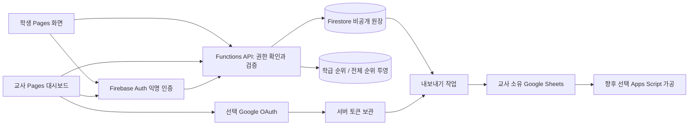

# 전체 시스템 아키텍처

기준일: 2026-09-15 · 변경 계약 반영: 2026-09-23 · CP5 구현 추록: 2026-10-05

> 현재 실행 구조는 CP3~4의 Cloudflare Worker를 기본 API로 사용하며 Functions fallback을 보존한다. 아래 초기 설계의 Functions OAuth/예약 작업 책임은 CP5에서 **Worker HTTPS callback + scheduled handler**로 구현했다. 개발 리소스는 실제 연결되어 있지만 CP5 Google/최종 운영 배포는 사용자 설정 게이트 전이다. 확정 구현·제한(199건 export, 충돌 자동 병합 없음, 5분/한 학급 작업)은 [CP5 구현 문서](CHECKPOINT5_GOOGLE_SHEETS.md)를 따른다. 운영 Firebase/Worker/OAuth client 분리 원칙은 유지한다.

## 1. 결정 요약

| 결정 | 선택과 이유 |
|---|---|
| 프런트엔드 | GitHub Pages 정적 HTML/CSS/ES modules. 기존 HTML 유지, `1math3.html`을 별도 진입점으로 추가할 계획 |
| 데이터 | 새 서비스의 원장은 Cloud Firestore. 기존 RTDB와 병합하지 않음. 계층별 소유권·게임별 조회에 맞춰 설계 |
| 백엔드 | Firebase Cloud Functions의 callable API + OAuth HTTPS callback + 예약 작업. 최초부터 점수·소유권·순위 집계는 서버 책임 |
| DB 접근 | 브라우저의 Firestore 직접 읽기/쓰기 모두 기본 거부. 모든 서비스 데이터는 권한 검사한 API로 반환. Rules는 방어선, Admin SDK 경로는 서버가 직접 검증 |
| 인증 | 학생 및 Google 없는 교사는 Firebase 익명 인증. ‘로그인 없이’는 계정 입력 불필요라는 UX이며 무인증 쓰기를 뜻하지 않음 |
| 소유권 | Firebase uid와 별개인 teacherId, classId, studentId. 서버의 활성 바인딩으로 접근권한 판단 |
| 복구 | 교사 관리 공간별 고엔트로피 복구 키. 공개 학급코드·이름·기기 저장만으로 복구하지 않음 |
| Google | 계정 연결과 Sheets 데이터 접근 동의를 구분. Sheets를 쓰지 않으면 어느 쪽도 강제하지 않음 |
| Sheets | Firebase 원장을 앱이 생성한 교사 소유 스프레드시트로 단방향 내보내기. 서버 OAuth, `drive.file` 최소 범위 |
| Apps Script | 선택적인 문서 내부 가공용 어댑터. 인증·성적·복구 원장으로 쓰지 않음 |
| 순위 | 학급용/전체용 자료를 물리적으로 분리. 같은 게임·버전·월에서 최고 기록 1개, 공동 순위. 전체 등록은 기본 켜짐 |

RTDB도 구현 가능하지만 새 요구사항의 교사·학급·문항 조회와 권한 경계를 문서 모델로 표현하기 위해 Firestore를 선택했다. 기존 서비스의 데이터 마이그레이션은 이 범위에 없다. 새 운영용 Firebase 프로젝트를 기존 게임 프로젝트와 분리하고, 개발/운영 프로젝트도 나누는 것을 배포 기준으로 한다. 따라서 기존 RTDB 규칙이 새 학생 데이터에 영향을 주지 않는다.

## 2. 구성도와 신뢰 경계



Pages의 소스·번들은 누구나 볼 수 있다. Firebase 웹 설정은 비밀키로 간주하지 않되 운영환경을 분리한다. 서비스계정 키, 복구 키, OAuth client secret·refresh token, 실제 학생 데이터는 저장소·번들·URL·분석 로그에 넣지 않는다. Sheets 서비스는 학생 화면이 직접 호출하지 않는다.

## 3. 교사 인증·소유권·복구

### 기본 흐름

1. 교사용 화면에서 익명 인증 후 `createTeacherSpace` 실행. uid에 서버가 teacherId 바인딩을 만든다. 클라이언트의 `role=teacher`를 신뢰하지 않는다.
2. 서버 CSPRNG로 `recoveryId + 256bit secret + checksum` 복구 키를 생성한다. 검증용 해시만 서버에 보관하고 키는 생성 시 한 번 반환한다. 다운로드/인쇄/복사 및 보관 확인 이후 학급 참여를 열 수 있다. 저장하지 않았으면 현재 인증 상태에서 새 키 발급 가능.
3. 브라우저 인증 지속성은 편의 기능이다. 개인 기기에서 지속 로그인 선택 가능, 공용 기기는 세션 지속만 기본값. 교사 앱은 학생 앱과 이름 있는 Firebase Auth 인스턴스 및 저장 키를 분리하고 학생 바꾸기가 교사 권한을 재사용하지 않게 한다. 같은 출처의 저장소 분리는 XSS 방어를 대체하지 않는다.
4. 처음에는 관리 공간당 소유자 한 명. 여러 학급을 가질 수 있다. 공동 교사 권한·학급 양도 UI는 v1에서 제외하고 향후 role 바인딩 확장으로 처리한다.

### 복구 절차

- 새 브라우저에서 새 익명 인증 후 복구 키를 POST 본문으로 제출. 키와 제한 상태를 검증하고 거래(transaction)로 기존 recoveryVersion을 소비한다.
- teacherId는 유지하면서 authEpoch를 증가시키고 기존 모든 교사 uid 바인딩을 비활성화한 뒤 새 uid를 연결한다. 새로운 복구 키를 한 번 반환한다. 모든 API는 현재 바인딩과 epoch를 조회하므로 기존 ID 토큰이 남아도 접근은 거부된다. Firebase refresh token 폐기도 병행한다.
- 복구 키는 관리 공간의 모든 학급에 대한 소유권이다. 학급코드는 학생 참여 전용으로 별개다. 키 재발급은 이전 키를 즉시 무효화하고 감사 이벤트를 남긴다.
- 복구 실패는 계정/키 존재를 구분하지 않는 메시지. uid·네트워크 단위 속도 제한과 지수 지연, 원문 키 로그 금지. 키만으로 무차별 영구 잠금을 유발하지 못하게 한다.
- 브라우저 인증·복구 키·연결 Google 계정을 **모두 잃으면 자동 복구 불가**. 학급명/학생 이름 주장만으로 양도하지 않는다. 이 한계를 키 보관 화면에 명확히 알린다.
- 복구는 Firebase 서비스 접근권 복구다. Google 계정이 연결되어 있었다면 서버 내보내기를 중지하고 토큰을 폐기한다. 새 소유 세션에서 해당 Google 계정을 다시 인증하기 전에는 Sheets URL/기존 문서 접근도 반환하지 않는다. Google 로그인 연결 자체도 복구 시 서비스 바인딩에서 비활성화한다. 학습 원장은 유지한다.

익명 계정 자동 삭제 옵션은 교사 관리권에 영향을 주므로 새 프로젝트에서 켜지 않는다. 향후 켜려면 명시적 계정 수명 정책과 복구 테스트가 먼저다. 사용자가 브라우저 데이터를 지운 뒤 같은 uid가 복원될 것이라고 가정하지 않는다.

### Google 연결과 충돌

Google 연결은 Firebase provider linking으로 현재 익명 uid를 유지하는 경로를 우선한다. teacherId를 바꾸거나 새 학급을 만들지 않는다. Google 로그인만 원하는 선택 사용도 허용하되 Sheets 권한은 그 기능 진입 때만 요청한다. Firebase 로그인 동의가 Sheets API 권한 또는 장기 refresh token을 자동 제공한다고 가정하지 않는다.

해당 Google 계정이 이미 다른 Firebase uid에 연결되어 있으면 자동 덮어쓰기하지 않는다. 현재 관리 공간에 대한 최근 인증 증거와 대상 Google 재인증 증거를 서버에서 모두 확인한다. 두 teacherId가 모두 존재하면 이전될 학급 목록을 보여준 뒤 서버 작업으로 통합한다. 학급 ownerTeacherId 변경·원본 바인딩 폐기·복구 키 교체·원본 Sheets 중지를 재개 가능한 작업으로 수행하고, 처리 중 관리 변경을 잠근다. 이메일 문자열 일치만으로 소유권을 이전하지 않는다. 이 충돌 흐름은 Google 연동 단계의 필수 검증 항목이다.

## 4. 학급코드·학생 바인딩

- classId는 서버 무작위 ID이며 재발급하지 않는다. 참여코드는 혼동 문자를 뺀 `ABCDEFGHJKMNPQRSTUVWXYZ23456789`에서 8자리 생성, 대소문자 정규화·표시용 하이픈 제거 후 검증한다.
- `joinCodes/{HMAC(code)}` 인덱스에 classId·codeVersion·expiresAt을 저장하고 transaction의 create-if-absent로 충돌 시 재생성한다. 비밀 HMAC 키는 서버 관리. 코드 표시용 원문은 비공개 학급 설정에서 암호화 보관한다.
- 기본 유효기간 발급 후 30일, 교사가 더 빨리 닫기/회전 가능. 만료·폐쇄·회전 시 신규 신청을 차단한다. 과거 코드를 다른 학급에 재사용하지 않도록 사용 이력 digest를 개인정보 없이 유지한다.
- 공개 코드에 개인정보·학교 식별 규칙을 넣지 않는다. 코드는 공유될 수 있으므로 유효 코드만 알아도 학급 순위/명단을 읽을 수 있게 하지 않는다.
- `requestJoin`은 uid별·학급별 중복 신청을 합치고 임시 studentId와 대조 표식을 만든다. 교사가 승인하면 `studentBindings/{uid}`가 classId/studentId에 활성 연결되고 학생의 전체 순위 등록 설정은 기본 켜짐으로 생성된다. 승인 전 학급 데이터는 반환하지 않는다.
- 교사만 128bit 무작위 일회용 학생 복귀 티켓을 발급한다. 10분 만료, 해시 저장, transaction 소비. 학생은 QR 스캔 또는 티켓 입력을 이용한다. 공개 짧은 학급코드만으로 복귀하지 않는다.
- 복귀 시 기존 학생 uid 바인딩을 폐기하고 새 uid에 연결한다(학생당 활성 기기 1개). 새 기기에서 이전 확정 회차를 이어 할 수 있다. 공용 기기 바꾸기에서는 서버 바인딩 폐기 요청과 로컬 세션 삭제를 수행한다.
- 참여 닫기는 이미 승인된 학생을 퇴출하지 않는다. 학생 차단은 바인딩 즉시 비활성화·새 기록 차단, 학급 보관은 새 신청·새 회차 차단 및 기존 진행 회차 미완료 종료, 과거 결과는 보존기간 내 조회 허용이다.

## 5. Firestore 논리 스키마

모든 경로는 **제안 스키마**이며 실제 생성되지 않았다. schemaVersion=1, 최초 generatorVersion=`1.0.0`. uid, teacherId, classId, studentId, gameId, sessionId는 문자열, 시간은 서버 UTC Timestamp, 점수/카운트는 정수다. Google 계정 식별은 검증된 provider subject로 처리한다. 문항의 난이도·배치를 바꾸는 생성기 변경은 rulesVersion 또는 curriculumVersion도 올려 이전 점수와 비교되지 않게 한다.

| 경로 | 핵심 필드 / 책임 |
|---|---|
| `games/{gameId}` | title, active, curriculumVersion, rulesVersion, generatorVersion, 허용 모드. 운영자만 변경 |
| `teachers/{teacherId}` | status, authEpoch, createdAt, Google 연결 상태. 실제 토큰 별도 |
| `teacherBindings/{uid}` | teacherId, epoch, active. 서버만 관리 |
| `recoveryKeys/{recoveryId}` | teacherId, secretHash, version, active. API에서도 해시 반환 금지 |
| `classes/{classId}` | ownerTeacherId, privateLabel, status, joinEnabled, codeVersion, globalOptIn(생성 시 true), createdAt, archivedAt |
| `joinCodes/{codeDigest}` | classId, version, expiresAt, active. 클라이언트 조회 금지 |
| `classes/{classId}/students/{studentId}` | privateName(optional), classAlias, status(pending/active/blocked), globalOptIn(승인 시 true), createdAt |
| `studentBindings/{uid}` | classId, studentId, active, bindingVersion |
| `studentReturnTickets/{ticketHash}` | classId, studentId, expiresAt, usedAt |
| `classes/{classId}/sessions/{sessionId}` | studentId, gameId, versions, seasonId, mode, seed(서버 전용), state, currentIndex, score, correct, wrong, skipped, unanswered, startedAt, endedAt, expiresAt, endReason, revision |
| `classes/{classId}/sessions/{sessionId}/answers/{questionIndex}` | typeId, subtype, operands, blankPosition, 단계별 최초 응답·정오, skip, serverReceivedAt, responseDuration 참고값, requestId |
| `classBoards/{boardId}/entries/{studentId}` | classId, boardKey, classAlias, bestScore, bestSessionId(비공개), projectionVersion |
| `globalBoards/{boardKey}/entries/{opaqueEntryId}` | globalAlias, bestScore, projectionVersion. 내부 식별자·학급 필드 없음 |
| `rankingLinks/{linkId}` | classId, studentId, boardKey, opaqueEntryId, bestSessionId. 서버 전용 역매핑, 삭제/집계에 사용 |
| `boardCounts/{scopeBoardId}` | 점수별 인원수(1math3은 0..500의 51개 버킷, 10점 간격), revision. 순위 = 높은 점수 인원 합 + 1 |
| `sheetConnections/{teacherId}` | 상태, 검증된 Google subject, tokenVaultRef, scopes, connectedAt. 브라우저 반환은 상태만 |
| `sheetExports/{classId}` | ownerTeacherId, spreadsheetId, spreadsheetUrl, exportVersion, status, lastSyncedAt, connectionVersion |
| `jobs/{jobId}` | 종류(rank/export/delete), 대상 ID, revision, state, attempt, nextRunAt, leaseUntil. 개인정보 원문 없이 참조만 |
| `auditEvents/{eventId}` | 관리자 actorId, action, targetId, at. 답안·이름·비밀키·토큰 제외 |

문서별 최대 크기/요청 크기를 제한하고 회차의 무제한 답안 배열을 만들지 않는다. 학생/교사 기본 문서를 지워도 하위 문서가 자동 삭제된다고 가정하지 않는다. 모든 데이터 조회는 만료와 삭제 상태를 검사한다.

### 인덱스 및 페이지 계약

- 자기 학급 세션: `(gameId, startedAt desc)`, `(gameId, studentId, startedAt desc)`, `(gameId, state, startedAt desc)`.
- 교사 학급: `(ownerTeacherId, status, createdAt desc)`.
- 대기 학생: `(status, createdAt)`.
- 순위: `(bestScore desc, documentId asc)`; boardId 자체가 classId/boardKey 범위를 고정한다.
- 작업: `(state, nextRunAt)`; 만료 청소는 expiresAt 기준.
- 목록은 최대 50건, 문항 상세는 1회차 최대 50건. 커서는 조회조건과 범위에 묶인 서버 검증 커서다. 임의 collectionGroup 조회를 클라이언트에 노출하지 않는다. 향후 게임의 점수 체계가 달라지면 game manifest의 scoreBuckets 계약을 사용하거나 해당 게임 전용 집계로 확장한다.

## 6. API 및 게임 코어 계약

모든 요청은 Firebase ID 토큰 검증, 활성 바인딩/소유권 검사, App Check(지원 환경), 입력 스키마·길이·열거값·속도 제한을 거친다. callable SDK가 토큰을 전달해도 endpoint별 권한 판단은 별도다. classId/studentId/score를 요청자가 지정했다고 신뢰하지 않는다. 요청의 classId는 바인딩과 비교하고 score는 받지 않는다.

| API | 입력 → 출력 / 권한 |
|---|---|
| `createTeacherSpace` | requestId → 관리 공간·1회 복구 키 / 새 교사 인증 |
| `recoverTeacherSpace` | recoveryId, secret, requestId → 교체된 관리권·새 키 / 새 인증 + 키 증명 |
| `createClass`, `rotateJoinCode`, `setClassStatus` | 설정·requestId → 학급·코드 또는 상태 / 소유 교사 |
| `requestJoin` | code, 선택 privateName, requestId → pendingId·대조 표식 / 학생 익명 인증 |
| `approveStudent`, `issueStudentReturnTicket` | classId, studentId → 상태/티켓 / 소유 교사 |
| `redeemStudentReturnTicket` | ticket, requestId → 새 바인딩 / 새 학생 인증 |
| `startSession` | gameId, mode, requestId → sessionId, versions, seasonId, expiresAt, 첫 PublicQuestion / 승인 학생 |
| `getSession` | sessionId → 확정 진행 위치·현재 문제/본인 결과 / 해당 학생 또는 소유 교사 |
| `submitAnswer` | sessionId, questionId, stepId, value 또는 skip, expectedRevision, requestId → 채점·해설·다음 단계/문제 / 해당 학생 |
| `finishSession` | sessionId, reason, requestId → authoritative Result, rankStatus / 해당 학생; 50문항 완료도 이 함수의 종료 처리 재사용 |
| `getLeaderboard` | gameId, version, seasonId, scope(class/global), cursor → RankPage / class는 승인 학생 또는 소유 교사; global은 인증된 방문자 |
| `listClassSessions`, `getSessionDetails` | classId, gameId, 필터·cursor → 요약/답안 / 소유 교사 |
| `setGlobalParticipation` | 허용 여부 → 등록/철회 작업 상태 / 자기 학생 또는 소유 교사; 양쪽 설정 AND |
| `beginGoogleConnection`, `createOrSelectSheet`, `syncSheet`, `disconnectSheets` | 설정·requestId → 진행 상태 / 소유 교사·최근 인증 |

`PublicQuestion={questionId,index,typeId,subtype,prompt,operands,visual,answerMode,stepId}`. 정답·미래 문제 seed는 공식 시작 응답에서 제외한다. 숫자로 정답을 추론하는 것은 정상 학습이며 정답 비공개만으로 부정행위를 막는다고 보지 않는다.

`Result={sessionId,gameId,versions,seasonId,completion,score,correct,wrong,skipped,unanswered,saveStatus,rankStatus}`.

`RankPage={boardKey,scope,asOf,projectionVersion,entries:[{displayAlias,score,rank,isMe}],nextCursor,myEntry}`. 브라우저에 bestSessionId·studentId·rankingLinks를 반환하지 않는다. myEntry는 현재 바인딩으로 서버가 구한다.

공통 오류: `AUTH_REQUIRED`, `FORBIDDEN`, `JOIN_UNAVAILABLE`, `PENDING_APPROVAL`, `SESSION_EXPIRED`, `REVISION_CONFLICT`, `RATE_LIMITED`, `NETWORK_UNAVAILABLE`, `REAUTH_REQUIRED`. 교사 UI에는 조치, 학생 UI에는 짧은 한국어 안내를 매핑한다. 내부 스택과 계정 존재 여부는 노출하지 않는다.

### 순수 코어와 어댑터

후속 구현의 코어는 `buildSession(seed, versions)`, `publicQuestion(item)`, `evaluateStep(item, response)`, `summarize(session)`로 분리한다. DOM/Firebase/현재 시각에 의존하지 않고 주입된 seed·clock을 사용한다. `GameService` 어댑터는 위 학생 API를 구현한다. Checkpoint 2의 `MockGameService`도 Promise·에러·저장 상태·버전을 같은 형태로 반환하며 실제 Firebase 설정을 읽지 않는다. 채점 로직을 프런트와 서버에서 공유하되 공식 점수의 권위는 서버 실행 결과다.

### 중복·동시성·종료

- uid+operation+requestId를 멱등 키로 사용한다. 동일 키·동일 본문은 기존 응답 반환, 다른 본문은 충돌. 비밀을 포함한 요청은 본문 원문을 보관하지 않고 digest로 비교한다. 키 생성/복구 응답의 비밀은 암호화된 단기 응답 봉투(10분, 동일 uid만)로 재전달하고 이후 다시 발급하게 한다.
- 학생/게임당 활성 정규 회차 1개. 중복 시작은 기존 회차를 반환한다. questionIndex·stepId·expectedRevision을 transaction으로 검증해 두 탭의 제출을 한 번만 확정한다.
- 서버가 문제 seed와 버전으로 정답을 다시 계산한다. 완료 시 서버 최초 응답 기록에서 점수 재계산, 결과 상태와 순위 작업을 같은 transaction으로 기록한다.
- 마지막 답과 직접 종료가 경합하면 transaction이 먼저 확정한 상태가 우선한다. 종료된 회차는 불변이다. 응답 유실은 requestId 또는 getSession으로 확인한다.
- 최종 완료 처리가 이미 되었으면 finish 재호출은 같은 결과를 반환한다. 50번째 답/건너뛰기 확정 시 자동 종료 처리하므로 브라우저가 바로 닫혀도 완료 결과가 남는다.

## 7. 순위 투영과 권한 표

학생 순위와 교사 상세 원장은 별도 컬렉션이다. ‘학생 공개’는 최소 필드 API 응답을 뜻하며 Firestore 익명 직접 읽기 허용을 뜻하지 않는다.

| 주체 | 학급 순위 | 전체 순위 | 상세 기록 | 변경 |
|---|---|---|---|---|
| 미인증 | 불가 | 인증 준비 안내 | 불가 | 불가 |
| 인증 방문자/승인 대기 | 불가 | 최소 순위 조회 | 불가 | 자기 참여 신청만 |
| 승인 학생 | 자기 학급만 | 최소 순위 조회 | 자기 회차만 | 자기 회차 API, 자기 공개 선택 |
| 교사 | 소유 학급만 | 최소 순위 조회 | 소유 학급만 | 소유 학급 관리 API |
| 순위/내보내기 worker | 필요한 원장만 | 집계 | 작업 대상만 | 전용 서버 권한 |

집계 worker는 session 완료 이벤트마다 더하는 대신 **현재 유효 원장에서 최고점을 계산해 upsert**한다. 학급·학생의 `globalOptIn`은 생성/승인 시 모두 true로 두고, 정규 회차 완료를 기본 전체 등록으로 처리한다. 어느 한쪽이 false이면 전체 순위 투영을 만들지 않거나 기존 행을 철회한다. 같은 작업 반복에도 순위 인원수가 늘지 않는다. entry 이전 점수 버킷 감소·새 점수 버킷 증가를 transaction으로 처리하고, revision이 오래된 작업은 덮어쓰지 못한다. 두 보드는 비동기 갱신 가능하며 UI는 `asOf`와 ‘순위 반영 중’을 표시한다. 목표 30초 내 반영, 2분 넘으면 경고·재시도 작업이며 완료 성적을 실패로 되돌리지 않는다.

삭제·차단·전체 등록 해제 때 대상 원장을 읽을 수 없게 먼저 tombstone을 설정하고 공개 행/역매핑/카운트를 재계산한다. API는 캐시된 행도 현재 공개 허용 상태로 필터링한다. 읽는 중 변경을 고려해 entries·버킷·revision을 일관된 snapshot에서 계산하고 페이지 커서가 오래되면 새로고침을 안내한다. 글로벌 페이지 캐시는 비식별 투영에만 최대 30초, 철회 대상은 즉시 제외 검증한다. 정확한 순위 제공이 어렵게 집계가 지연되면 순위 갱신 중으로 표시하고 임의 순위를 만들지 않는다.

본인 최고 기록 삭제 시 남은 유효 회차에서 다음 최고점을 선택한다. 공개 등록 해제는 학습 원장 삭제와 다르다. 교사/학생 API가 전체 DB를 다운로드하여 클라이언트에서 순위를 계산하는 방식은 금지한다.

## 8. 선택 Google Sheets 및 Apps Script

### 기본 연동

1. 교사가 ‘Google Sheets 연결’을 선택한다. 최근 교사 인증과 소유권 확인 → 필요하면 Firebase Google provider 연결 → Google API 권한 승인.
2. 별도 서버 OAuth authorization-code flow 사용. state는 uid/teacherId/authEpoch·허용 반환경로·만료에 묶인 일회용 값. PKCE와 고정 redirect URI, code replay 차단, 검증된 Google subject 일치 확인. 임의 redirect URL을 받지 않는다.
3. `drive.file` 및 필요한 기본 신원 범위만 요청한다. Sheets 전체 접근/Drive 전체 접근·Apps Script 범위를 기본으로 요청하지 않는다. 서버에서 offline access refresh token을 받아 암호화 보관하고 브라우저에 전달하지 않는다.
4. 대시보드의 ‘이 학급 관리표 만들기’가 교사 계정으로 문서를 생성하고 응답 ID·URL을 서버에 저장한다. **학급당 1문서**, 여러 게임은 `gameId` 열로 구분한다. 앱이 이미 만든 연결 목록에서 선택할 수 있으며 입력 URL/ID는 받지 않는다.
5. 시트 탭: `안내`, `학생요약`, `회차`, `문항`. 기본 내보내기는 학급 별명만 사용하고 선택 이름은 교사가 별도로 포함을 켠 경우만 포함. uid·복구 키·참여코드·전체 별명 연결표는 내보내지 않는다.
6. Firebase를 원장으로 유지한다. 시트 수정은 게임 성적·학급권한을 바꾸지 않는다. 앱 관리 탭은 덮어쓸 수 있음을 알리고 교사 수식/가공은 별도 탭에서 작성한다.

`exportId=(classId, exportVersion)` 생성 잠금과 작업 상태를 저장한다. 문서 생성은 앱의 exportId를 Drive appProperties에 기록할 수 있는 Drive 파일 생성 경로를 사용하고, 재시도 전에 해당 앱 생성 파일을 조회하여 기존 파일을 재연결한다. 생성 응답 유실 시 목록 조회의 일시 지연을 고려해 즉시 또 만들지 않고 대기·재조회한다. 중복 발견 시 가장 이른 문서를 유지하며 사용자 파일을 자동 삭제하지 않는다. 생성 API의 원자성을 가정하지 않는다.

동기화는 sessionId/questionIndex를 행 키로 삼는 upsert 또는 앱 관리 탭의 결정적 재작성으로 중복 행을 막는다. 확정 회차만 기본 대상이며 자동 동기화는 변경을 모아 최대 분당 1회/학급, 수동 버튼은 진행 상태 반환. 게임 저장 성공은 Sheets 성공에 의존하지 않는다. 재시도는 지수 backoff·횟수 상한·대시보드 오류 표시, 토큰 취소/만료는 `REAUTH_REQUIRED`로 중단한다. Google 승인은 보통 최초 연결 시만 필요하지만 취소·토큰 만료·정책 변경 시 재승인을 요구할 수 있다.

문서는 생성 시 교사 개인 소유, 링크 공개 설정을 켜지 않는다. 연결 해제는 큐 중지·토큰 폐기·접근 매핑 정리이며 교사 문서를 자동 삭제하지 않는다. 이미 내보낸 개인정보는 외부 사본이다. 학생 삭제 시 연결이 살아 있으면 앱 관리 탭 삭제 동기화를 수행하고, 해제/오류/교사 복사본은 교사에게 직접 삭제할 범위를 안내한다. 자유입력 값은 Sheets API `RAW` 입력과 수식 시작문자 방어를 적용한다.

### 향후 Apps Script 경계

초기 Sheets 자동 생성/동기화에 Apps Script를 필수로 두지 않는다. 나중에 교사가 선택한 경우에만 문서 내부 요약·서식·보고서 작업을 부가 기능으로 제공한다. 입력 계약은 `exportVersion, gameId, sessionId, questionIndex`와 문서 내부의 앱 관리 탭이다. 기본적으로 Script는 Firebase에 접근하지 않는다.

백엔드 호출이 필요한 확장에서는 별도 검토를 거쳐 교사 인증을 검증하는 좁은 API만 제공한다. ‘개발자 권한으로 실행하는 공개 웹앱’에 학급코드만 보내 성적을 읽고 쓰게 하지 않는다. Apps Script의 실행 주체·추가 scope·설치 동의·할당량은 해당 단계에서 공식 문서로 재검증한다. 최초 Sheets 승인만으로 미래 Apps Script 권한까지 영구 승인되었다고 약속하지 않는다.

## 9. 개인정보·보안·운영 정책

아래는 서비스의 기본 정책 결정이며 법률 적합성 인증이 아니다. 실제 학교 운영 전 운영 주체가 처리 목적·법적 근거·보호자/학교 절차·국외 처리·보유기간·삭제 연락처를 확정해야 한다. 그 전에는 합성 데이터로만 개발/검증한다.

| 위험 | 대응 및 남는 한계 |
|---|---|
| 코드 추측·외부 가입 | 8자리 무작위·만료·회전·교사 승인·속도 제한. 교사가 확인 없이 승인하면 외부인 참여 가능 |
| 이름 사칭·동명이인 | 이름을 인증/키로 사용하지 않음. 현장 표식 확인, 교사 발급 학생 복귀 티켓 |
| 교사 기기 분실 | 복구 키/선택 Google 연결, 복구 시 모든 바인딩 폐기. 모든 증명 분실은 복구 불가 |
| 클라이언트 점수 조작 | 서버 문항·응답·채점, 회차 nonce/버전/순서·멱등성. 자동 풀이·대리 응시까지 완전히 방지할 수 없음 |
| 전역 개인정보 유출 | 기본 전체 등록을 시작 화면에서 고지, 독립 별명·opaque ID, 최소 응답, 상세 데이터 물리 분리, 교사/학생 해제·철회. 학급 동료의 추측 가능성은 완전히 제거 불가 |
| XSS·비밀 유출 | 텍스트 출력, 입력 크기 제한, CSP 가능 범위 적용, 인라인 스크립트 최소화, 의존성 고정, 로그 마스킹 |
| 과금·봇 | App Check와 Auth에 더해 서버 요청 제한, 읽기 50건 상한, 요청당 크기 상한, maxInstances·예산 경고·운영 중지 스위치 |
| Google 권한 과다 | 최소 scope, 암호화 token vault, 전용 worker IAM, revocation, 저장소/클라이언트 비밀 금지 |
| 공용 기기 | 학생 바꾸기·교사 잠금, 민감 응답 메모리 중심, 서비스워커 캐시 금지, 연습 결과와 pending 요청도 로그아웃 시 제거 |

초기 서버 한도: 참여 신청 uid당 5회/10분 및 네트워크 단위 완만한 추가 제한(학교 공용 NAT 고려), 학급 대기 100명, 활성 학생 100명, 교사 학급 20개, 학생 정규 시작 20회/일·한 번에 1회, 순위 조회 uid당 30회/분. 초기 운영값이며 관측 후 설정으로 조정한다. 교사 대규모 일괄 작업은 별도 큐 처리한다. IP는 학습 데이터로 저장하지 않고 남용 제한용 짧은 수명 digest만 사용한다. 정상 학습을 차단하면 연습은 유지한다.

### 보유·삭제 기본값

- 회차·문항 상세: 종료 후 90일. 미완료 서버 회차는 24시간 후 종료 처리하고 종료 후 90일. 임시 참여 대기는 7일, 복귀 티켓은 10분. 만료 시 API에서 즉시 제외하고 청소 작업으로 물리 삭제한다.
- 순위: 현재 월과 이전 2개월 제공, 월 시작 +3개월 되는 시점부터 비공개·삭제. 점수 투영에 이름·세부답안은 포함하지 않는다.
- 학생 프로필: 학급 활성 동안 유지, 보관 후 90일 삭제. 교사 공간은 활성 소유권 동안 유지하고 모든 학급 삭제 후 90일 비활동이면 제거 예정 안내 후 정리한다. 감사 이벤트는 90일, 개인정보 없는 서비스 통계만 장기 보유 가능.
- 명시적 학생/학급 삭제는 먼저 접근 차단하고 jobs에서 답안·세션·프로필·바인딩·순위·역매핑·내보내기 행을 재귀 삭제, 재실행 안전하게 처리한다. 목표 7일 이내 완료, 실패 작업은 운영자 알림. 개인정보 없는 코드 재사용 방지 digest만 남긴다.
- TTL은 지연될 수 있고 하위 컬렉션을 지우지 않으므로 유일한 삭제 수단으로 쓰지 않는다. 만료 접근 차단과 예약 청소를 병행한다. 백업을 켜는 경우 별도 최대 30일 보존, 복원 후 삭제 tombstone 재적용으로 삭제 데이터 부활 방지. 외부 교사 사본은 통제 한계를 안내한다.

보유기간 경계에서 원장 만료가 공개 최고기록 재집계를 깨지 않도록 worker는 board 유효기간과 원장 상태를 확인한다. 만료 회차를 새 최고점 후보로 복원하지 않는다. 기간별 순위는 보존된 비식별 투영을 유지할 수 있으나 명시적 학생 삭제/철회는 항상 우선한다.

## 10. Pages 배포 및 계획 디렉터리

현재는 아래 파일/폴더를 생성하지 않는다(문서 제외). 기존 index는 실제 게임이므로 무단 포털 전환하지 않는다.

```text
gamemaking/
  index.html                  기존 로컬 연산 게임 유지
  1math1.html                  기존 게임 유지
  1math2.html                  기존 게임 유지
  1math3.html                  후속 학생 진입점
  teacher/index.html          후속 교사 진입점
  src/
    games/1math3/             manifest, generator, evaluator, explanations
    shared/                  ID/버전/결과 스키마, 순수 공통 코어
    student/                 게임 상태와 UI
    teacher/                 교사 UI
    services/                GameService, MockGameService, FirebaseGameService
  assets/                    자체 그림·스타일·접근성 자원
  functions/src/             auth, classes, sessions, rankings, sheets, jobs
  firebase/                  후속 rules·indexes·emulator 설정
  tests/                     생성·상태·API·권한·브라우저 검증
  docs/                      Checkpoint 문서
  references/                원본, 배포 대상 아님
  dist/                      후속 Pages 전용 빌드 산출물
```

Pages는 정적 호스팅이므로 Functions/OAuth callback/토큰 보관을 그 안에서 실행할 수 없다. 경로는 프로젝트 하위 경로를 지원하는 상대 URL, teacher는 실제 index.html 진입으로 처리하여 SPA fallback에 의존하지 않는다. CI는 허용된 정적 파일만 dist에 넣어 배포하며 references·docs의 내부 기록·functions·테스트·비밀·로컬 임시 파일을 제외한다. 저장소 공개 여부와 지도서 재배포 권한은 별도 확인하고 참고자료를 자동으로 git add하지 않는다.

개발/운영의 Firebase config·API origin을 분리한다. Firebase authorized domains·OAuth origin 및 callback은 실제 Pages 주소 확정 후 등록한다. 백엔드는 허용 origin만 CORS 처리하지만 CORS를 인증 대신 쓰지 않는다. 교사 API 응답은 no-store. 선택한 Firestore 위치와 Functions 위치를 함께 결정하고 개인정보 처리 공지에 반영한 뒤 생성한다. 기존 프로젝트 위치를 복제한다고 가정하지 않는다.

Functions 운영에는 Blaze 과금 계정 등 배포 준비가 필요하다. 요금·한도·리전·OAuth 공개 상태를 후속 연결 단계에서 검증하고 승인된 예산이 없으면 실서비스 배포하지 않는다. Checkpoint 2의 로컬 학생 게임 구현에는 과금/운영 계정이 필요 없다.

## 11. 후속 필수 검증

1. Emulator와 API 통합 검사: 교사 A가 B의 학급 읽기/변경 불가, 학생은 타인 답안 조회 불가, direct Firestore 전체 거부.
2. 복구 키 재사용·동시 복구·키 분실·이전 uid 토큰·학생 티켓 재사용·Google 계정 충돌 검증.
3. 점수 변조·중복 start/submit/finish·종료 경합·24시간 만료·새로고침·네트워크 유실·두 탭 검증.
4. gameId/버전/월 격리, KST 월말, 동일 학생 최고점, 동점 1,1,3, 동점 50행 경계, 삭제 후 다음 최고점 검증.
5. 모든 학생 응답 JSON에 이름·학급코드·내부 ID·오답·토큰이 섞이지 않는 allowlist 검사.
6. 전체 공개 철회·삭제와 worker 재시도 경합으로 데이터가 다시 나타나지 않아야 한다.
7. OAuth 거절·철회·토큰 만료·동일 계정 확인, 문서 생성 응답 유실·중복 클릭, 내보내기 중복/삭제/수식 입력 검증.
8. 학교 공용 NAT·다수 학생 동시 참여 부하, 예산·오류 알림, 동기화 장애가 게임 저장을 막지 않는지 검증.

## 12. 공식 기술 검토 근거

2026-09-15 확인. 링크는 기능 존재/제약 근거이며 위 스키마·한도·복구 정책은 프로젝트 설계 결정이다.

- [Firebase 익명 인증](https://firebase.google.com/docs/auth/web/anonymous-auth), [계정 연결](https://firebase.google.com/docs/auth/web/account-linking): 익명 시작과 provider 연결 지원. 익명 자동 정리 정책 주의.
- [Firestore 보안 개요](https://firebase.google.com/docs/firestore/security/overview), [쿼리 보안](https://firebase.google.com/docs/firestore/security/rules-query): 클라이언트 Rules와 서버 IAM 경계. 서버 라이브러리는 Rules를 우회하므로 API 검증 필수.
- [Callable Functions](https://firebase.google.com/docs/functions/callable), [App Check](https://firebase.google.com/docs/app-check): 토큰 전달/앱 확인 지원. App Check만으로 모든 남용을 막을 수 없음.
- [Google Sheets scope](https://developers.google.com/workspace/sheets/api/scopes), [문서 생성](https://developers.google.com/workspace/sheets/api/guides/create): 앱 관련 파일 범위 및 프로그램 방식의 생성 지원.
- [Drive 파일 생성](https://developers.google.com/workspace/drive/api/guides/create-file), [앱 전용 파일 속성](https://developers.google.com/workspace/drive/api/guides/properties): 생성 작업 식별과 재연결에 활용. Workspace 파일에 미리 생성한 ID를 강제로 부여하는 방식은 사용하지 않음.
- [서버 OAuth](https://developers.google.com/identity/protocols/oauth2/web-server), [OAuth 토큰 수명](https://developers.google.com/identity/protocols/oauth2): 서버 토큰 교환·offline access·권한 취소 고려. 외부 앱 Testing 상태의 추가 범위 refresh token은 7일 만료 가능.
- [Apps Script 웹앱](https://developers.google.com/apps-script/guides/web): 실행 주체별 권한 차이가 있으므로 공개 웹앱을 무조건 신뢰하지 않음.
- [GitHub Pages 정의](https://docs.github.com/en/pages/getting-started-with-github-pages/what-is-github-pages): HTML/CSS/JavaScript 정적 호스팅.
- [Firestore TTL](https://firebase.google.com/docs/firestore/ttl): 즉시 삭제 보장 없음, 하위 컬렉션 자동 삭제 없음.
- [Functions 한도](https://firebase.google.com/docs/functions/quotas): Blaze 및 운영 한도·비용 관리 필요.
